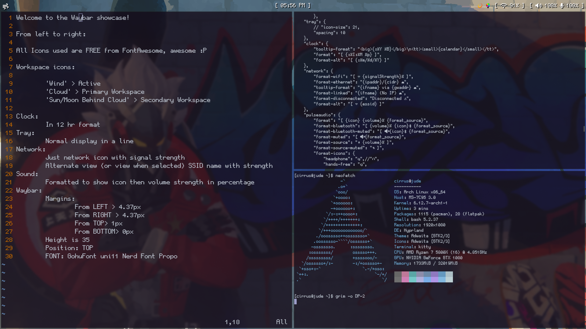

Waybar theme: Cirrus

Hello, this is my simple bitmap Waybar called 'Cirrus' for use with the Arch Linux Operating System and Hyprland Desktop Environment!
Workspace icons are cloud based which are pleasant to look at especially for cloud lovers. 

Dependencies:
  FONT Package: ttf-profont-nerd 
	FONT Package: ttf-font-awesome

Installation:
  1.) This configuration requires both the fonts 'Font Awesome' and 'GohuFont uni11 Nerd Font Propo' to be installed you may do so using the commands:
      $sudo pacman -S ttf-profont-nerd
			$sudo pacman -S ttf-font-awesome

  **WARNING STEP 2 WILL REPLACE CURRENT config AND style.css SO MAKE BACKUPS BEFORE DOING SO!
  2.) Copy the 'config' and 'style.css' files into your "~/.config/waybar/" directory.
