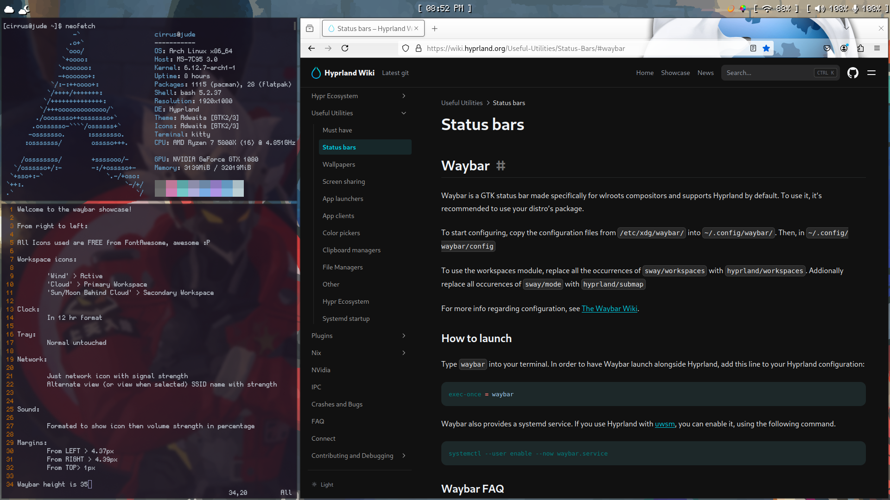

Hello, this is my simple bitmap Waybar for use with the Arch Linux Operating System and Hyprland Desktop Environment!
Workspace icons are cloud based which are pleasant to look at especially for cloud lovers. 

Installation:

Copy the 'config' and 'style.css' files into your "~/.config/waybar/" directory.
**WARNING THIS WILL REPLACE CURRENT config and style.css so MAKE BACKUPS BEFORE DOING SO!
